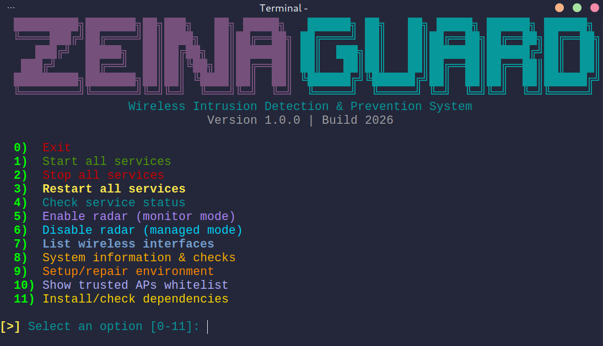

<div align="center">

# Wireless Intrusion Detection & Prevention System


</div>

## **Overview**

**ZeinaGuard** is a comprehensive **Wireless Intrusion Detection & Prevention System (WIDPS)** that provides real-time monitoring, analysis, and protection against wireless security threats. Built with cutting-edge technology and designed for both security professionals and network administrators.

### **Prerequisites**
```
Linux System: (Ubuntu, Debian, Fedora, Arch, AntiX, Kali, etc.)
Wireless Adapter: with monitor mode support
Root/Sudo: Access for network operations
2GB+ RAM and 2GB+ Disk Space
```

### **Installation**

```bash
git clone https://github.com/ln0rag/zeinaguard.git
cd zeinaguard
chmod +x zeina.sh
sudo ./zeina.sh
```

### **Cache Cleanup**

```bash
chmod +x delete-cache.sh
sudo ./delete-cache.sh
```

### **Access Your System**
```
Web Dashboard: http://localhost:3000
API Endpoint: http://localhost:5000
```

#### **Hardware Requirements**
```
CPU: 1+ cores (2+ recommended)
RAM: 512MB minimum (2GB recommended)
Storage: 2GB free space
Network: Wireless adapter with monitor mode
Permissions: Root/sudo access
```
#### **Recommended Hardware**
```
Alfa AWUS036ACH: High performance monitor mode
TP-Link TL-WN722N v1: Budget-friendly option
Panda PAU09: Dual-band support
Generic USB WiFi: Most adapters work
```
#### **Contributing**

1. **Fork** the repository
2. **Create** a feature branch
3. **Make** your changes
4. **Test** thoroughly
5. **Submit** a pull request

#### **Development Guidelines**
```
Code Quality: Follow PEP 8 and ESLint standards
Testing: Add tests for new features
Security: Report vulnerabilities responsibly
```
---

#### **License**

This project is licensed under the **MIT License** - see the [LICENSE](LICENSE) file for details.

---

<div align="center">

#### **Protect Your Wireless Networks with ZeinaGuard**

[ Star on GitHub ](https://github.com/ln0rag/zeinaguard) • [ Report Issues ](https://github.com/ln0rag/zeinaguard/issues)

Made for the cybersecurity community

</div>
