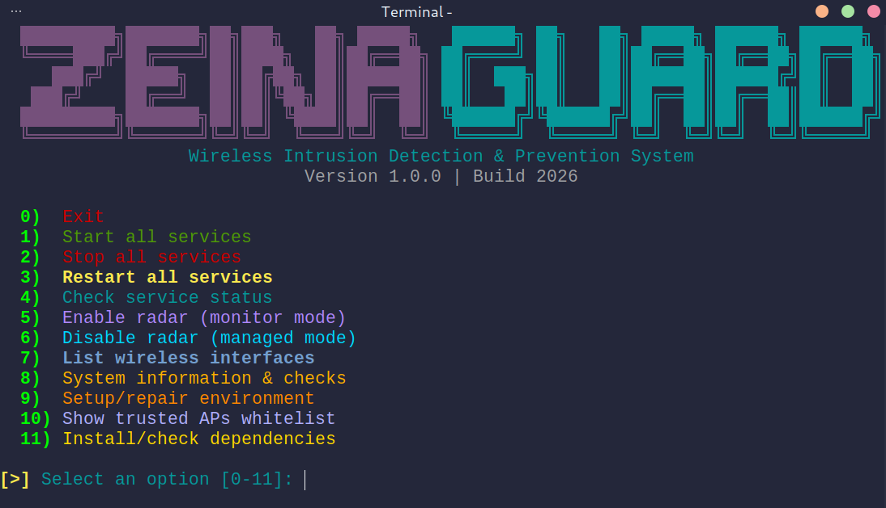

# ZeinaGuard

**Wireless Intrusion Detection & Prevention System (WIDPS)**: a Wi-Fi sensor, a real-time backend, and a web dashboard, launched together with a single command.



## What it does

* Puts a wireless adapter into monitor mode and runs a Python sensor (Scapy) on it.
* Sends sensor data to a Flask backend over an authenticated API.
* Streams events live to a Next.js dashboard through Socket.IO.
* Stores data in PostgreSQL and uses Redis.
* Creates the `.env` file, JWT secret, and API token automatically on first run.
* Creates Python virtual environments and installs all dependencies for you.
* Starts the backend, frontend, and sensor, and waits for health checks to pass.
* Stops all services and cleans up logs and cache on `Ctrl+C`.

## Architecture

| Component | Stack | Port |
|-----------|-------|------|
| `sensor/` | Python, Scapy | none |
| `backend/` | Flask, Flask-SocketIO, SQLAlchemy, Gunicorn (eventlet) | `5000` |
| Frontend (`app/`, `components/`, `hooks/`, `lib/`, `styles/`) | Next.js 16, React 19, Tailwind CSS 4, Radix UI, Recharts, Zustand | `3000` |
| Database | PostgreSQL | `5432` |
| Cache | Redis | `6379` |

## Project structure

```
zeinaguard/
├── app/            Next.js pages
├── components/     UI components
├── hooks/          React hooks
├── lib/            Frontend utilities
├── styles/         Styles
├── public/         Static assets
├── backend/        Flask API + Socket.IO server
├── sensor/         Wireless sensor (monitor mode)
├── scripts/        Helper scripts (e.g. realtime pipeline validation)
├── zeina.sh        Launcher: setup, run, and cleanup
└── Makefile        Shortcuts for zeina.sh
```

## Requirements

* Linux
* Root privileges (`sudo`)
* A Wi-Fi adapter that supports monitor mode
* Python 3
* Node.js 20 or later (`pnpm` is installed automatically if missing)
* PostgreSQL and Redis
* `curl`, `rfkill`, `ip`, `iwconfig`/`iw`, `nmcli` (optional)
* At least 512 MB RAM, 1 CPU core, and 2 GB free disk space

## Installation

Run:

```bash
git clone https://github.com/Ln0rag/zeinaguard.git && \
cd zeinaguard && \
sudo ./zeina.sh
```

Or with Make:

```bash
sudo make run
```

On first run the launcher:

1. Creates a default `.env` with a random `JWT_SECRET_KEY`.
2. Creates `backend/.venv` and `sensor/.venv` and installs their requirements.
3. Installs frontend dependencies with `pnpm`.
4. Lets you pick a wireless interface (or uses the saved one) and enables monitor mode.
5. Generates an `API_TOKEN` for the sensor and frontend.
6. Starts the backend, frontend, and sensor.

## Usage

Once everything is up:

| Service | URL |
|---------|-----|
| Dashboard | http://localhost:3000 |
| Backend API | http://localhost:5000 |
| Health check | http://localhost:5000/health |

Press `Ctrl+C` to stop all services. The launcher kills leftover processes on ports `3000` and `5000`, clears logs, and removes Python cache files.

Logs are written to `logs/` and runtime state to `.zeinaguard-runtime/`.

## Configuration

Settings live in `.env` at the project root (created automatically):

| Variable | Purpose |
|----------|---------|
| `POSTGRES_USER`, `POSTGRES_PASSWORD`, `POSTGRES_DB`, `POSTGRES_HOST`, `POSTGRES_PORT` | PostgreSQL connection |
| `REDIS_HOST`, `REDIS_PORT`, `REDIS_PASSWORD` | Redis connection |
| `BACKEND_URL`, `NEXT_PUBLIC_API_URL`, `NEXT_PUBLIC_SOCKET_URL` | Backend address used by the sensor and dashboard |
| `JWT_SECRET_KEY` | Secret used to sign tokens (generated randomly) |
| `API_TOKEN`, `NEXT_PUBLIC_API_TOKEN` | Token for sensor and frontend authentication (generated) |
| `SENSOR_REGISTRATION_KEY` | Pre-shared key for sensor registration. Empty means open registration |
| `DB_POOL_SIZE`, `DB_POOL_MAX_OVERFLOW`, `DB_POOL_TIMEOUT_SECONDS`, `DB_POOL_RECYCLE_SECONDS` | Database connection pool |

> Before any real deployment: change `POSTGRES_PASSWORD` and set a strong `SENSOR_REGISTRATION_KEY`.

## Development

```bash
pnpm install
pnpm dev          # frontend on port 3000
pnpm build        # production build
pnpm lint         # ESLint
```

## Notes

* The launcher supports Linux only.
* The monitor-mode step takes the adapter off NetworkManager. Use it only on a spare adapter, or restore managed mode afterwards.
* The `make backend`, `make frontend`, and `make sensor` targets are deprecated. Use `zeina.sh`.
* Use only on networks and devices you own or are authorized to monitor.
